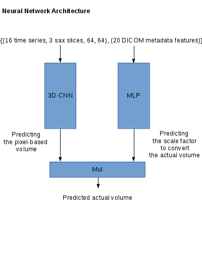

# Second Annual Data Science Bowl

Code for [Second Annual Data Science Bowl](). 16th place.

# Sumamry

A Hybrid Deep CNN/MLP.

It is used only 3 sax slices to predict the actual volume, is not used segmentation techniques, is not needed hand-labelings.



Detail: [simple locatlization](TODO), [neural network definition](TODO), [cumulative distribution function](TODO), [model ensemble and bagging](TODO).

## Developer Environment

- Ubuntu 14.04
- 12GB RAM 
- GPU & CUDA (I used EC2 g2.2xlarge instance)
- [Torch7](http://torch.ch/)
- Ruby
- dicom (rubygems)
- graphicsmagick (luarocks)

## Installation

Install CUDA and Torch7 first. See [NVIDIA CUDA Getting Started Guide for Linux](http://docs.nvidia.com/cuda/cuda-getting-started-guide-for-linux/#abstract) and [Getting started with Torch](http://torch.ch/docs/getting-started.html).

```
sudo apt-get install libgraphicsmagick-dev ruby rubygems
sudo gem install dicom
luarocks install graphicsmagick
```

## Data

Place the [data files](https://www.kaggle.com/c/second-annual-data-science-bowl/data) into a subfolder ./data.

```
% ls ./data
test  train  train.csv  validate  validate.csv
```

## For validation set

    ./run_all.sh

## For test set

    ./run_all_test.sh

NOTICE: I used 8 g2.xlarge instances to execute this script. See comments in `./run_all_test.sh`.
